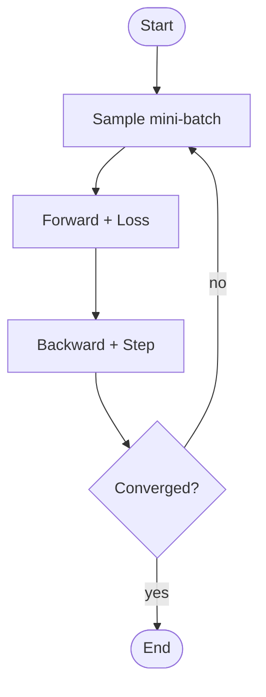
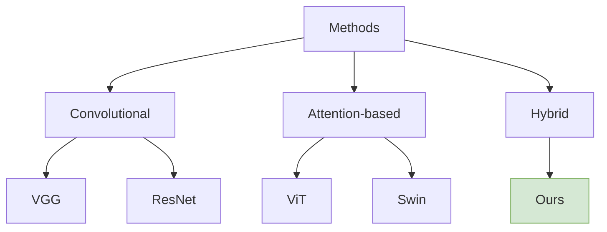

# Excalidraw Cookbook

Excalidraw excels at **hand-drawn-style sketches** — great for intro-chapter concept figures and "system vibes" diagrams where polish would feel clinical. It does **not** do precise technical drawings as cleanly as draw.io or TikZ.

## Output modes

1. **Scene descriptor** (default, for arbitrary layouts): a structured text prompt that **the user manually recreates** in the Excalidraw canvas, or pastes into a third-party Text-to-Diagram plugin if they have one. The agent must not call any plugin itself.
2. **Mermaid snippet** (preferred when the figure is a graph/flowchart/state machine): Excalidraw has a built-in *Mermaid to Excalidraw* converter (New menu → *Mermaid to Excalidraw*) — paste the snippet, click *Insert*, done.
3. **Excalidraw JSON** (rare, only when user insists): verbose native format; user pastes via *File → Open → select a `.excalidraw` file*.

---

## Scene descriptor format

Every scene uses exactly this block. **Units are pixels.** **Coordinates `(x, y)` are the top-left corner of the node's bounding box.** Omitted fields fall back to the `STYLE` defaults.

```
CANVAS: <width>x<height> px, background=<#rrggbb|transparent>
STYLE:  roughness=<0|1|2>, strokeWidth=<1|2|4>, font=<Hand-drawn|Normal|Code>, strokeColor=<#rrggbb>
NODES:
  <id>  <shape>  "<label>"  at (<x>,<y>) px  size <w>x<h> px  fill=<#rrggbb|none>  stroke=<#rrggbb>
  ...
EDGES:
  <from-id> -> <to-id>  "<edge-label>"  style=<solid|dashed|dotted>  arrowhead=<triangle|dot|none>  curvature=<0|1|2>
  ...
GROUPS:
  "<group-label>"  contains [<id>, <id>, ...]  bounding=<dashed|solid>
ANNOTATIONS:
  text "<content>"  at (<x>,<y>) px  rotation=<deg>
```

Shapes allowed: `rectangle | ellipse | diamond | arrow | line | text | freedraw`.

**Required fields**: every NODE must have `id`, `shape`, `label`, `at`, `size`. Fill/stroke inherit from STYLE if omitted.
**Optional fields**: `GROUPS` and `ANNOTATIONS` blocks.
**Coordinate origin**: canvas top-left = (0, 0); x grows right, y grows down (standard screen coordinates).

---

## Recipe 1 — System overview (descriptor)

Palette roles follow [style-conventions.md](style-conventions.md): Data = blue, Preprocess = yellow, Model = green, Loss = orange.

```
CANVAS: 1400x800 px, background=#ffffff
STYLE:  roughness=2, strokeWidth=2, font=Hand-drawn, strokeColor=#1e1e1e
NODES:
  A  rectangle  "Dataset"       at (80, 360) px   size 180x80 px   fill=#dae8fc  stroke=#6c8ebf
  B  rectangle  "Preprocess"    at (320,360) px   size 180x80 px   fill=#fff2cc  stroke=#d6b656
  C  rectangle  "Backbone"      at (560,360) px   size 180x80 px   fill=#d5e8d4  stroke=#82b366
  D  rectangle  "Head"          at (800,360) px   size 180x80 px   fill=#d5e8d4  stroke=#82b366
  E  ellipse    "Loss"          at (1040,370) px  size 140x60 px   fill=#ffe6cc  stroke=#d79b00
EDGES:
  A -> B  ""    style=solid  arrowhead=triangle  curvature=0
  B -> C  "x"   style=solid  arrowhead=triangle  curvature=0
  C -> D  "h"   style=solid  arrowhead=triangle  curvature=0
  D -> E  "y"   style=solid  arrowhead=triangle  curvature=0
GROUPS:
  "Model"  contains [C, D]  bounding=dashed
ANNOTATIONS:
  text "Fig. 1. End-to-end pipeline."  at (80, 720) px  rotation=0
```

---

## Recipe 2 — Concept / motivation figure (descriptor)

```
CANVAS: 1200x700 px, background=transparent
STYLE:  roughness=2, strokeWidth=2, font=Hand-drawn
NODES:
  SPACE  rectangle  "Problem Space"  at (80, 80) px   size 1040x540 px  fill=#fafafa  stroke=#424242
  PRIOR  ellipse    "Prior Work"     at (200,280) px  size 360x220 px   fill=#ffe0b2  stroke=#e65100
  OURS   ellipse    "Ours"           at (680,200) px  size 300x220 px   fill=#c8e6c9  stroke=#1b5e20
EDGES:
  PRIOR -> OURS  "extends"  style=dashed  arrowhead=triangle  curvature=1
ANNOTATIONS:
  text "Fig. 2. Positioning relative to prior work."  at (80, 660) px  rotation=0
```

---

## Recipe 3 — Model structure (layered stack, descriptor)

```
CANVAS: 600x900 px, background=#ffffff
STYLE:  roughness=1, strokeWidth=2, font=Hand-drawn
NODES:
  L1  rectangle "Input: x"               at (160, 40) px   size 280x50 px  fill=#f5f5f5  stroke=#616161
  L2  rectangle "Linear D->H"            at (160,110) px   size 280x50 px  fill=#dae8fc  stroke=#6c8ebf
  L3  rectangle "LayerNorm"              at (160,180) px   size 280x50 px  fill=#e1d5e7  stroke=#9673a6
  L4  rectangle "xN Transformer Blocks"  at (160,250) px   size 280x80 px  fill=#d5e8d4  stroke=#82b366
  L5  rectangle "MLP Head H->C"          at (160,350) px   size 280x50 px  fill=#ffe6cc  stroke=#d79b00
  L6  rectangle "Output: y"              at (160,420) px   size 280x50 px  fill=#f5f5f5  stroke=#616161
EDGES:
  L1 -> L2  ""  style=solid  arrowhead=triangle  curvature=0
  L2 -> L3  ""  style=solid  arrowhead=triangle  curvature=0
  L3 -> L4  ""  style=solid  arrowhead=triangle  curvature=0
  L4 -> L5  ""  style=solid  arrowhead=triangle  curvature=0
  L5 -> L6  ""  style=solid  arrowhead=triangle  curvature=0
```

---

## Recipe 4 — Algorithm loop (Mermaid fallback)

For any flowchart / state machine / decision diagram, the **Mermaid fallback is strongly preferred**: users paste it into Excalidraw's built-in *Mermaid to Excalidraw* converter and get auto-layout for free.

````markdown

````

In Excalidraw: click the **New** menu → *Mermaid to Excalidraw* → paste the block between ```` ```mermaid ```` fences → *Insert*. The auto-rendered shapes are fully editable (drag, recolor, re-style) afterward.

---

## Recipe 5 — Dependency / taxonomy tree (Mermaid)

````markdown

````

---

## Roughness guidance

- `roughness=2` (most sketchy): Introduction / motivation / concept figures.
- `roughness=1`: Method-chapter figures where you want a casual tone but still readable.
- `roughness=0`: Don't use Excalidraw — switch to draw.io or TikZ.

## Stroke-width mapping (Excalidraw discretizes line weight)

Excalidraw offers only `1 | 2 | 4` for `strokeWidth`. Map from the paper convention ([style-conventions.md](style-conventions.md) says 1.2–1.6 pt):

| Convention (pt) | Excalidraw `strokeWidth` |
|---|---|
| 0.8–1.2 pt | 1 |
| 1.2–1.6 pt | 2 (default) |
| > 1.6 pt   | 4 (only for heavy emphasis; avoid for body figures) |

## Color & palette

- Stick to [style-conventions.md](style-conventions.md) hex codes — the Material pastel subset (50–100 shades) for fills, 700–900 for strokes. Saturated colors clash with the hand-drawn aesthetic.
- Keep ≤ 4 distinct hues per figure.

## Paste instructions (what to tell the user)

**Scene descriptor** (Recipes 1–3):

1. Open [excalidraw.com](https://excalidraw.com).
2. *Properties → Edge: sharp|round → round* and *Sloppiness: artist* (matches roughness=2) or *cartoonist* (roughness=1).
3. For each NODE in the descriptor: press `R` (rectangle), `O` (ellipse), `D` (diamond); drag from the listed top-left `(x, y)` to `(x+w, y+h)`; double-click, type the label.
4. For each EDGE: press `A` (arrow); click source, drag to target; if the edge has a label, double-click the arrow and type.
5. *Tip*: select all → *Ctrl/⌘+G* (group) to lock layout before polishing strokes.
6. Export via *Menu → Save as image → PNG/SVG*. Use **SVG** for paper inclusion.

**Mermaid snippet** (Recipes 4–5):

1. Open [excalidraw.com](https://excalidraw.com).
2. Top toolbar → **New** (icon with a plus) → *Mermaid to Excalidraw*.
3. Paste the Mermaid code (without the ```` ```mermaid ```` fences) into the left pane.
4. Click *Insert*. Shapes land on the canvas; adjust colors/stroke per [style-conventions.md](style-conventions.md).
5. Export via *Menu → Save as image → SVG*.
