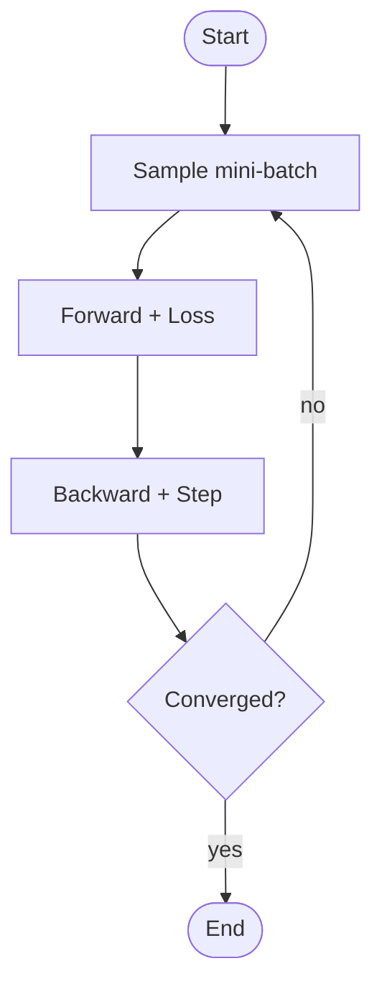

# Excalidraw Cookbook

## Scene Descriptor Format

```text
CANVAS: <width>x<height> px, background=<#rrggbb|transparent>
STYLE: roughness=<0|1|2>, strokeWidth=<1|2|4>, font=<Hand-drawn|Normal|Code>, strokeColor=<#rrggbb>
NODES:
  <id> <shape> "<label>" at (<x>,<y>) px size <w>x<h> px fill=<#rrggbb|none> stroke=<#rrggbb>
EDGES:
  <from-id> -> <to-id> "<edge-label>" style=<solid|dashed|dotted> arrowhead=<triangle|dot|none> curvature=<0|1|2>
GROUPS:
  "<group-label>" contains [<id>, <id>] bounding=<dashed|solid>
ANNOTATIONS:
  text "<content>" at (<x>,<y>) px rotation=<deg>
```

Coordinates are top-left pixel coordinates. Shapes: rectangle, ellipse, diamond, arrow, line, text, freedraw.

## System Overview Descriptor

```text
CANVAS: 1400x800 px, background=#ffffff
STYLE: roughness=2, strokeWidth=2, font=Hand-drawn, strokeColor=#1e1e1e
NODES:
  A rectangle "Dataset" at (80,360) px size 180x80 px fill=#dae8fc stroke=#6c8ebf
  B rectangle "Preprocess" at (320,360) px size 180x80 px fill=#fff2cc stroke=#d6b656
  C rectangle "Backbone" at (560,360) px size 180x80 px fill=#d5e8d4 stroke=#82b366
  D ellipse "Loss" at (800,370) px size 140x60 px fill=#ffe6cc stroke=#d79b00
EDGES:
  A -> B "" style=solid arrowhead=triangle curvature=0
  B -> C "x" style=solid arrowhead=triangle curvature=0
  C -> D "y" style=solid arrowhead=triangle curvature=0
GROUPS:
  "Model" contains [C] bounding=dashed
```

## Mermaid Flowchart

Use Mermaid for dependency graphs, flowcharts, and state machines:



## Paste Instructions

Scene descriptor:

1. Open excalidraw.com.
2. Set edge style/sloppiness to match roughness.
3. Create each listed node at the given coordinates and size.
4. Add each edge and label.
5. Export SVG for paper inclusion.

Mermaid:

1. Open Excalidraw.
2. Use `New -> Mermaid to Excalidraw`.
3. Paste Mermaid code without fences.
4. Insert and adjust style.
